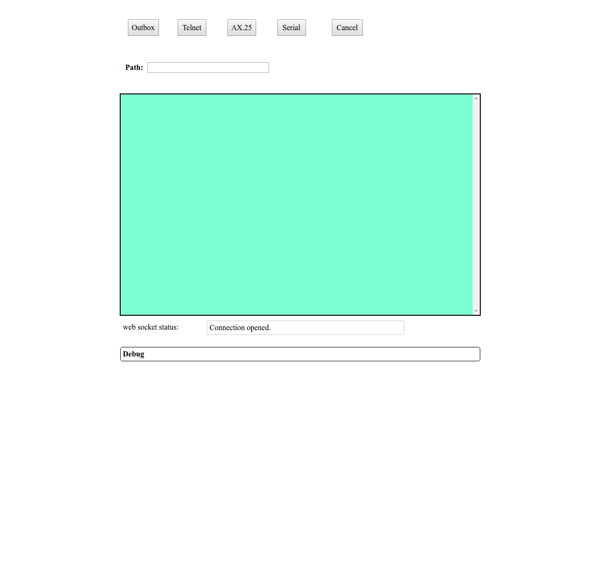

# Linux paclink-unix install for UDRC

## Install core components

* This installation assumes you have already [installed core components](https://github.com/nwdigitalradio/n7nix/blob/master/CORE_INSTALL.md)


## Install paclink-unix, Dovecot & hostap

* This script will install the following:
  * paclink-unix basic
  * dovecot imap mail server
  * hostap for WiFi connection
  * iptables for NAT
  * dnsmasq for DHCP & DNS to enable mobile device connection without
  Internet
  * node.js for web app control of paclink-unix

* You will be required to enter:
  * callsign
  * Winlink password
  * Real name
* To create an SSL certificate you will be required to enter:
  * Country name (2 letter code)
  * State or province (full name)
  * Locality (eg. city)
  * Organization name, skip
  * Organizational Unit Name, skip
  * server FQDN ( eg. check_test5.localnet
  * email address
* For host access point you will be required to enter:
  * SSID (eg. bacon)

### Start the install script

```bash
sudo su
cd n7nix/config
./app_install.sh pluimap
```
* Upon completion you should see:

```
paclink-unix with imap, install script FINISHED

app install (pluimap) script FINISHED
```

## Start paclink-unix webserver

* In a separate console window start up the node.js server for
paclink-unix control.

```bash
sudo su
cd /usr/local/src/paclink-unix/webapp
nodejs plu-server.js
````
# How to Test Mail client
###### Sending mail is a two step process
* Compose an e-mail with your e-mail app
* Send the e-mail with paclink-unix with a web interface

###### Receiving mail is a two step process
* Get e-mail using paclink-unix
* Reading an e-mail with your e-mail app

## Test PLU web interface

### Testing webapp

#### Install node.js & required modules
* nodejs & the required modules are installed with the _plu/pluimap_install.sh_ script

### Test webapp

* nodejs should be started manually like this:
```
sudo su
cd /usr/local/src/paclink-unix/webapp
nodejs plu-server.js
```

* This will take over the console & outputs a verbose amount of debug statements from the node.js app, _plu-server.js_
* Now open a browser & go to: __your_ip_address__:8082
* Should see something like the following:

---



---

# Configure a mail client

## [mutt or Neomutt e-mail client](https://www.neomutt.org/)
* mutt is configured by default in the  [mutt install script](https://github.com/nwdigitalradio/n7nix/blob/master/plu/mutt_install.sh)
  * mutt is installed by default when paclink-unix is installed.

## [K-9 Mail Android client](https://k9mail.github.io/)
* Reference configuration for K-9 Mail

### Fetching mail

#### Incoming server

* IMAP server: 10.0.42.99
* Security: SSL/TLS
* Port: 993
* Username: <login_user_name>
* Authentication: Normal password
* Password: <login_password>

### Sending mail

#### Outgoing server

* SMTP server: 10.0.42.99
* Security: SSL/TLS
* Port: 465
* Require sign-in: check mark
* Username: <login_user_name>
* Authentication: Normal password
* Password: <login_password>

